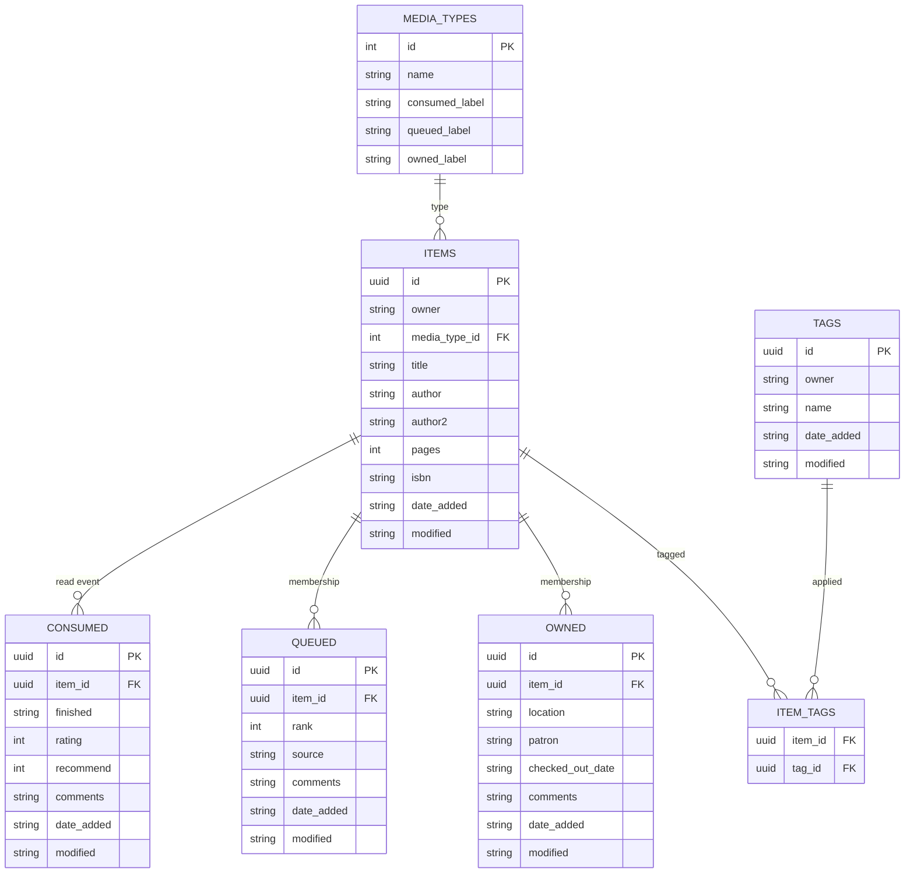
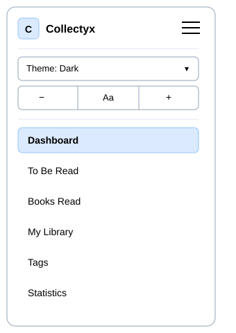
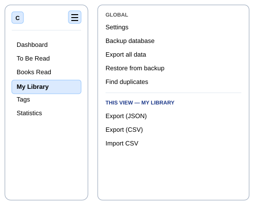
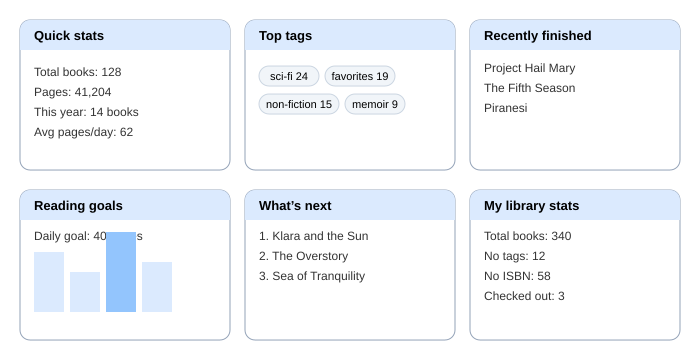
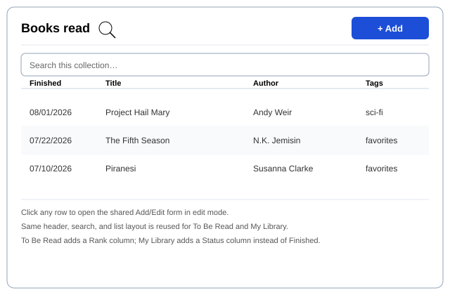
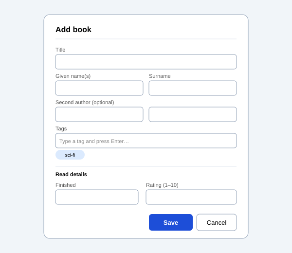
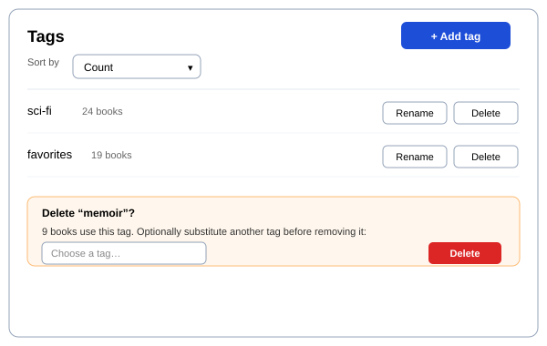
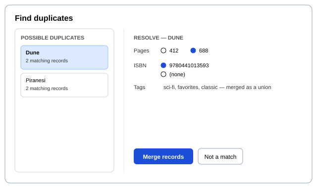

# Collectyx — Design Document

**Status:** Draft, for review
**Scope:** v1 (Books only). Architecture designed to extend to additional
media types later without schema rework.
**Companion document:** Phased implementation plan (separate document, follow-up).

---

## 1. Purpose

Collectyx is the successor to Scriptum, rebuilt on a normalized
multi-media schema instead of Scriptum's three independent flat tables.
Scriptum remains frozen and in daily use; nothing in this document changes
Scriptum itself. Collectyx starts as a fresh Tauri v2 + web project,
Books-only in v1, structured so a second media type (DVD/Blu-ray, CD,
digital movies, etc.) can be added later as data, not a rewrite.

---

## 2. Design principles

- **Sidebar navigation**, not a top nav bar — validated pattern already
  used in Astryx and Mindforge, chosen specifically because it scales
  past a handful of sections and gives Settings and Tags a permanent home.
- **Context-aware hamburger menu** — a Global section (Settings, Backup,
  Export all data, Restore, Find duplicates) plus a section that changes
  to match whichever collection is currently active. Resolves Scriptum's
  long-open "too many ways to export" issue by consolidating location,
  not by cutting the operation count.
- **One shared CRUD pattern across all three collections** — same Add
  button, same search/filter, same export/import treatment, same
  Add/Edit modal shape, on Books Read, To Be Read, and My Library alike.
- **Tags are the only classification axis.** No Category field anywhere
  in Collectyx — that concept doesn't exist in this schema at all, not
  even as a deprecated column.
- **"Do one thing and leave."** Collectyx is not a browse-and-linger app.
  Design choices favor a fast path from opening the app to completing one
  add/search/edit action, not session-long multi-record workflows.
- **No automatic ISBN lookup/enrichment.** ISBN is a real field, entered
  manually or (later) by barcode scan, never guessed from a title/author
  search. Coverage will be inconsistent — many records will have no ISBN
  — and nothing in the app depends on it being present.
- **Full user separation.** Each user's records are entirely their own
  row set. No shared catalog, no cross-user tag or book sharing.

---

## 3. Schema

### 3.1 Entity relationship diagram



### 3.2 Table definitions

**`media_types`** — reference table, one row per media type. v1 ships
with exactly one row.

| Column           | Type       | Notes                                               |
| ---------------- | ---------- | --------------------------------------------------- |
| `id`             | INTEGER PK |                                                     |
| `name`           | TEXT       | e.g. `Books`                                        |
| `consumed_label` | TEXT       | UI label for the "consumed" role, e.g. `Books Read` |
| `queued_label`   | TEXT       | UI label for the "queued" role, e.g. `To Be Read`   |
| `owned_label`    | TEXT       | UI label for the "owned" role, e.g. `My Library`    |

Seed data: `(1, 'Books', 'Books Read', 'To Be Read', 'My Library')`.

**`items`** — the canonical record for one physical/logical thing
(a book, eventually a DVD, etc.). Fields here are intrinsic to the item
itself, not to any particular collection membership.

| Column          | Type                          | Notes                                                     |
| --------------- | ----------------------------- | --------------------------------------------------------- |
| `id`            | TEXT (UUID) PK                |                                                           |
| `owner`         | TEXT                          | user identifier; fully separates each user's rows         |
| `media_type_id` | INTEGER FK → `media_types.id` | `1` for all rows in v1                                    |
| `title`         | TEXT NOT NULL                 |                                                           |
| `author`        | TEXT                          |                                                           |
| `author2`       | TEXT                          | optional second author                                    |
| `pages`         | INTEGER                       | nullable                                                  |
| `isbn`          | TEXT                          | nullable; manual entry or scan only, never auto-populated |
| `date_added`    | TEXT                          | YYYY-MM-DD                                                |
| `modified`      | TEXT                          | YYYY-MM-DD                                                |

No `category` column exists anywhere in this schema — deliberately.
Classification is tags-only, via `tags`/`item_tags` below.

**`consumed`** (formerly `books_read`) — one row per read event. A
re-read is a second row with the same `item_id`, not a duplicate item.

| Column       | Type                 | Notes                       |
| ------------ | -------------------- | --------------------------- |
| `id`         | TEXT (UUID) PK       |                             |
| `item_id`    | TEXT FK → `items.id` |                             |
| `finished`   | TEXT NOT NULL        | YYYY-MM-DD                  |
| `rating`     | INTEGER              | 1–5, nullable — Skip(1)/Okay(2)/Good(3)/Excellent(4)/Essential(5) |
| `recommend`  | INTEGER              | 0/1, nullable               |
| `comments`   | TEXT                 | notes specific to this read |
| `date_added` | TEXT                 |                             |
| `modified`   | TEXT                 |                             |

**`queued`** (formerly `reading_list`) — membership in the to-consume
list.

| Column       | Type                 | Notes                        |
| ------------ | -------------------- | ---------------------------- |
| `id`         | TEXT (UUID) PK       |                              |
| `item_id`    | TEXT FK → `items.id` |                              |
| `rank`       | INTEGER              | nullable = unranked          |
| `source`     | TEXT                 | e.g. "a friend", "a podcast" |
| `comments`   | TEXT                 |                              |
| `date_added` | TEXT                 |                              |
| `modified`   | TEXT                 |                              |

No `my_library_id` column. In the old flat schema this field existed
only to link a Reading List row back to its My Library origin. Under
normalization, a `queued` row and an `owned` row for the same physical
book already share the same `item_id` — the link is implicit and
survives automatically, no separate foreign key needed.

**`owned`** (formerly `my_library`) — membership in the personal
collection.

| Column             | Type                 | Notes                           |
| ------------------ | -------------------- | ------------------------------- |
| `id`               | TEXT (UUID) PK       |                                 |
| `item_id`          | TEXT FK → `items.id` |                                 |
| `location`         | TEXT                 | bookshelf or free-text location |
| `patron`           | TEXT                 | nullable; set when checked out  |
| `checked_out_date` | TEXT                 | nullable                        |
| `comments`         | TEXT                 |                                 |
| `date_added`       | TEXT                 |                                 |
| `modified`         | TEXT                 |                                 |

**`tags`** — first-class tag entity, not a JSON array on the item. This
is Collectyx's tag storage from day one; there is no legacy flat-array
format to migrate away from the way Scriptum eventually will.

| Column       | Type           | Notes                                         |
| ------------ | -------------- | --------------------------------------------- |
| `id`         | TEXT (UUID) PK |                                               |
| `owner`      | TEXT           |                                               |
| `name`       | TEXT NOT NULL  | always lowercase                              |
| `date_added` | TEXT           |                                               |
| `modified`   | TEXT           | enables sort-by-last-updated in the Tags view |

**`item_tags`** — junction table, many-to-many between `items` and
`tags`.

| Column    | Type                 | Notes |
| --------- | -------------------- | ----- |
| `item_id` | TEXT FK → `items.id` |       |
| `tag_id`  | TEXT FK → `tags.id`  |       |

Composite primary key `(item_id, tag_id)`.

**`settings`** — one row per owner.

| Column  | Type    | Notes                                                                  |
| ------- | ------- | ---------------------------------------------------------------------- |
| `owner` | TEXT PK |                                                                        |
| `data`  | TEXT    | JSON blob: theme, font size, backup folder, dashboard card order, etc. |

### 3.3 Merge (Find Duplicates)

Not a new table. A merge operation, given a survivor `item_id` and a
loser `item_id`:

1. Reassigns every `consumed`/`queued`/`owned` row's `item_id` from loser
   to survivor.
2. Reassigns every `item_tags` row from loser to survivor (deduplicating
   if the survivor already has that tag).
3. For any field where the two items' values differ, the user picks
   which value wins (no automatic rule).
4. Deletes the loser `items` row.

All of this runs as a single atomic transaction, consistent with the
project's existing `replace_all_*` pattern.

Candidate detection is fuzzy title+author matching (the same normalization
approach Scriptum already uses for its "Multiple Reads" filter), with a
matching non-empty ISBN on both sides treated as corroborating evidence
when available — never as the sole signal, since ISBN coverage will be
inconsistent.

---

## 4. Views

### 4.1 Sidebar chrome



Two zones. Top: logo, app name (from a named constant, not hard-coded),
hamburger menu, theme selector, font-size stepper — theme and font size
stacked vertically. Bottom: nav list in order Dashboard, To Be Read,
Books Read, My Library, Tags, Statistics.

**Assumption flagged for review:** nav labels here use `media_types`'
`queued_label`/`consumed_label`/`owned_label` directly ("To Be Read" /
"Books Read" / "My Library") rather than inventing separate hard-coded
sidebar strings, so the labels are single-sourced from the schema we
designed rather than duplicated in two places. If a different label
should show in the sidebar vs. inside `media_types`, say so and this
changes.

### 4.2 Hamburger menu



Opens as an overlay, not a navigation — closing it returns you to
exactly where you were. Global section is always present. The second
section swaps based on the active view; shown here with My Library
active. Dashboard, Tags, and Statistics have no contextual section since
none of Export/Import apply to them.

**Assumption flagged for review:** "Settings" opens as a modal rather
than a dedicated full view, since its remaining v1 fields (backup
folder, daily reading goal) are few enough not to need a whole screen.
Confirm or correct before this gets built.

### 4.3 Dashboard



Six cards: Quick Stats, Top Tags (new), Recently Finished, Reading
Goals, What's Next, My Library Stats. Quick Actions is retired — its
contents (Settings, Export All Data, Backup Database, Restore from
Backup) now live in the hamburger's Global section.

### 4.4 Collection views (shared template)



One layout, reused for Books Read, To Be Read, and My Library. Header
row: title, search icon, Add button. Below: quick search, then a list of
records; clicking any row opens it in the shared Add/Edit modal. Per-view
differences are limited to which columns show and which fields the
Add/Edit modal exposes in its type-specific section — the shell is
identical.

|                            | Books Read (consumed)       | To Be Read (queued) | My Library (owned)                 |
| -------------------------- | --------------------------- | ------------------- | ---------------------------------- |
| Extra list column          | Finished date               | Rank                | Status (available/checked out)     |
| Type-specific modal fields | Finished, Rating, Recommend | Rank, Source        | Location, Patron, Checked-out date |

### 4.5 Add/Edit modal



Shared shell across all three collections: Title, Author (given/surname),
optional second author, Tags (chip input, same component as Scriptum's
existing one), then a labeled section for the fields specific to
whichever collection opened the modal. Same modal serves both Add and
Edit — Edit is just pre-populated.

### 4.6 Tags (full CRUD view)



Add, rename, delete, usage count, sort by name/count/last-updated (now
possible since `tags.modified` is a real column, not derived). Delete
shows an inline panel offering an optional substitute tag before
removing — declining the substitution just removes the tag outright.

### 4.7 Find duplicates / Merge



Reached from the hamburger's Global section. Left pane lists candidate
duplicate pairs found via fuzzy title+author matching. Selecting one
shows a field-by-field comparison on the right; any field where the two
records disagree requires the user to pick a value. Tags merge as a
union automatically, no conflict to resolve there. Confirms before
committing — never auto-merges.

### 4.8 Statistics

Not separately sketched — layout is close to Scriptum's existing
Statistics view. One change: the category bar chart is gone entirely
(no Category field exists to chart); replaced by a top-N-tags-by-count
chart, same data source as the Dashboard's Top Tags card, N as a named
constant.

---

## 5. Migration from Scriptum

Collectyx does not inherit Scriptum's "every past export must always
import cleanly" obligation — that rule exists for Scriptum's own
continuity, not Collectyx's. Collectyx needs a one-time import path for
a Scriptum backup file, not permanent backward compatibility.

Import rules:

- **Reading List and My Library data is not migrated** — treated as
  empty on import. This removes the hard cross-collection identity-match
  problem entirely (nothing to match against).
- **Books Read migrates into `items` + `consumed`.** Each Books Read
  record becomes one `items` row (media_type = Books) plus one `consumed`
  row. Historical re-reads are not required to be merged at import time —
  if the same book appears as two separate `items` rows because the
  importer didn't recognize them as duplicates, Find Duplicates cleans
  that up later, on demand, with no data loss either way.
- **Category converts to a tag**, lowercased, deduplicated against any
  tags already on that book — same rule already designed for Scriptum's
  own `#55`.
- **ISBN carries over as-is**, with no attempt to validate or enrich it.

---

## 6. Data layer API

The UI never touches IndexedDB, SQLite, or `invoke()` directly. Everything
goes through `DBManager`, which selects `DBManagerWeb` or `DBManagerTauri`
at runtime. Both expose the identical surface below, so no code above this
layer knows which backend is active.

Note this replaces Scriptum's generic `DBManager.get/getAll/put/delete(storeName, ...)`
surface, which does not exist in Collectyx. Store names are an
implementation detail of the backends now, not something callers pass in.

### 6.1 Surface

```js
// Collections — 'consumed' | 'queued' | 'owned'
await DBManager.getCollection(collection)             // → joined records
await DBManager.getCollectionRecord(collection, id)
await DBManager.saveCollectionRecord(collection, rec) // → { id, ItemId }
await DBManager.deleteCollectionRecord(collection, id)
await DBManager.replaceCollection(collection, records)

// Items
await DBManager.getAllItems()
await DBManager.saveItem(item)
await DBManager.deleteItem(itemId)      // cascades to memberships + tags
await DBManager.attachTag(itemId, tagId)
await DBManager.detachTag(itemId, tagId)

// Tags
await DBManager.getAllTags()            // each carries a usage Count
await DBManager.saveTag(tag)            // create or rename
await DBManager.deleteTag(tagId, substituteTagId)   // substitute optional
await DBManager.replaceAllTags(tags)

// Merge (§3.3)
await DBManager.mergeItems(survivorId, loserId, fieldResolutions)

// Restore (§5, §11) — atomic full-database replace in one transaction
// (one Rust transaction / one IndexedDB transaction). Wipes and rewrites
// items/consumed/queued/owned/tags/item_tags and settings (filtered
// through an allow-list) as a single unit; a failure partway through
// leaves the pre-restore state completely unchanged. data is the same
// {Items, Consumed, Queued, Owned, Settings} shape produced by gathering
// getAllItems()/getCollection()/getAllTags()/getSettings() together, or
// by parsing a backup file. Coexists with the per-collection
// replaceCollection() above, which still covers single-collection use
// cases (e.g. CSV import into one collection) that don't need
// cross-table atomicity.
await DBManager.restoreAll(data)

// Media types, settings
await DBManager.getAllMediaTypes()
await DBManager.getSettings()           // → object, or null if never set
await DBManager.saveSettings(obj)

// Lifecycle
await DBManager.init()
DBManager.close()
DBManager.deleteDatabase()              // web only; no-op warning on Tauri
```

### 6.2 The joined record

`getCollection()` returns flat PascalCase records with the item's fields
and the membership row's fields side by side. The join is free on SQLite
and simulated in JS on IndexedDB; callers cannot tell the difference.

```js
{
  id: 'con-1',              // the membership row's id
  ItemId: 'itm-dune',       // the canonical item
  Owner: 'local',
  MediaTypeId: 1,
  Title: 'Dune',                // ┐
  Author: 'Herbert, Frank',     // │
  Author2: null,                // ├─ from items
`  Pages: 412,                   // │
  ISBN: '9780441013593',        // ┘
  Tags: ['classic', 'scifi'],   // resolved tag names, sorted
  Finished: '2020-06-01',       // ┐
  Rating: 4,                    // ├─ collection-specific
  Recommend: 1,                 // │
  Comments: 'first read',       // ┘
  DateAdded: '2020-06-01',      // the membership row's own timestamps
  Modified: '2020-06-01',
  ItemDateAdded: '2026-01-01',  // the item's, kept separate so the
  ItemModified: '2026-01-02'    // join loses neither
}
```

Fields beyond the shared item ones, per collection:

| Collection | Additional fields                                  |
| ---------- | -------------------------------------------------- |
| `consumed` | `Finished`, `Rating`, `Recommend`, `Comments`      |
| `queued`   | `Rank`, `Source`, `Comments`                       |
| `owned`    | `Location`, `Patron`, `CheckedOutDate`, `Comments` |

A membership row whose parent item is missing is omitted from results and
logged, rather than returned with an undefined `Title`.

### 6.3 Write semantics

**A field absent from the payload keeps its stored value; a field present
as `null` is cleared.** One `items` row is shared across collections, so
saving a `queued` record that carries only `Rank` must not blank the
`Pages` and `ISBN` a `consumed` record set. Callers therefore send only
what they mean to change, and must not spread a full object padded with
`undefined`.

**`Tags` follows the same rule.** Omitting the key leaves existing tags
untouched; `[]` removes all of them; an array sets the tags to exactly
that list. Names are lowercased, trimmed, and deduplicated by the data
layer, and tag rows are created on demand.

**Reusing `ItemId` is how one book joins a second collection.** Saving a
record with an existing `ItemId` attaches a new membership row to that
same item. Saving without one mints a new item. This is what makes
"mark finished" work without re-entering title and author, and what keeps
a re-read a second `consumed` row rather than a duplicate book.

**Deleting distinguishes membership from item.**
`deleteCollectionRecord()` removes only the membership row — the item
survives, since it may belong to other collections, and an item with no
memberships is still a valid catalogue entry. `deleteItem()` removes the
item and everything hanging off it: SQLite via `ON DELETE CASCADE`,
IndexedDB via an explicit cascade written to match.

**Writes are atomic.** A save covering the item row, the membership row,
and tag reconciliation commits as one transaction on both backends; a
failure partway through leaves nothing half-applied.

### 6.4 Backend-specific notes

Neither affects callers, but both explain behaviour that would otherwise
look arbitrary.

**Web.** IndexedDB has no joins, so stores load into memory and resolve
via `Map` lookups. Writes commit first, then invalidate the affected
caches; the next read repopulates. Bulk paths invalidate once rather than
per row. Chosen over per-query cursor walks because the dataset is one
user's collection, and over denormalizing on write because that
reintroduces the duplication normalization removes.

**Tauri.** `db-manager-tauri.js` completes a partial payload against its
stored record before invoking, so Rust receives a complete record and both
backends apply identical rules by construction. Costs one extra read per
save, which is not material at this scale, and keeps the absent-versus-null
logic in one place rather than reimplemented in Rust.

**Owner.** `items`, `tags`, and `settings` carry `owner`; the membership
tables derive it through `item_id`. v1 writes and reads everything under
`CONSTANTS.DEFAULT_OWNER` (`'local'`) and has no auth. The column exists
now so a future multi-user sync needs no migration.

---

## 7. Open questions / assumptions to confirm

1. Sidebar nav labels sourced directly from `media_types` — confirm or
   override (§4.1).
2. Settings as a modal rather than a full view — confirm or override
   (§4.2).
3. Membership table names: `consumed` / `queued` / `owned` — confirmed
   already, included here for completeness.
4. Nav structure is fixed at 6 items for Books-only v1; how nav scales
   once a second media type exists (one row per type × three roles, vs.
   a unified list filtered by type) is explicitly out of scope for this
   document and deferred until that becomes real.
